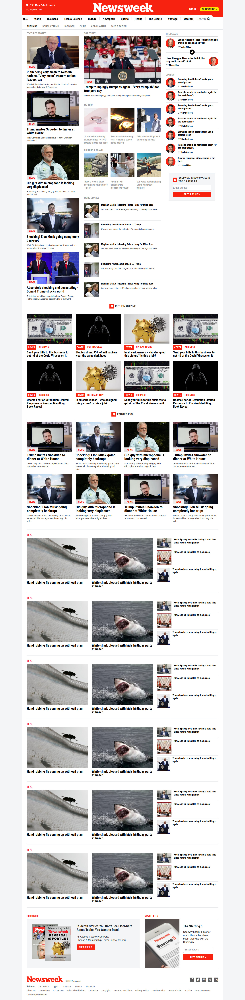

# Responsive Design and CSS Frameworks - Part 2


> This project was developed as a learning project part of the Microverse curriculum.



An HTML and CSS mockup of the homepage of newsweek.com with focus on Bootstrap, which I used a lot to achieve the same layout and proportions of the original page.

## Live demo

🔗 [newsweek Website Clone](https://raw.githack.com/marcode95/newsweek-clone/development/index.html)

## Built With

- HTML5,
- CSS3,
- Google Fonts,
- Font awesome
- Bootstrap


## Getting Started

To get a local copy up and running follow these simple example steps.

### Prerequisites

Webbrowser and access to internet

### Install

1) [Download](Clone the repository to your machine)

```sh
$ git clone https://github.com/marcode95/newsweek-clone/tree/development
```

2) Navigate to the project folder and execute the "index.html" file.

### Usage

Just navigate through the page.

## Authors

👤 **Marco Erhardt**

- Github: [@marcode95](https://github.com/marcode95)


## 🤝 Contributing

Contributions, issues and feature requests are welcome!

Feel free to check the [issues page](issues/).

## Show your support

Give a ⭐️ if you like this project!

## Acknowledgments

- Microverse for showing the way for this project to happen

## 📝 License

This project is [MIT](lic.url) licensed.
